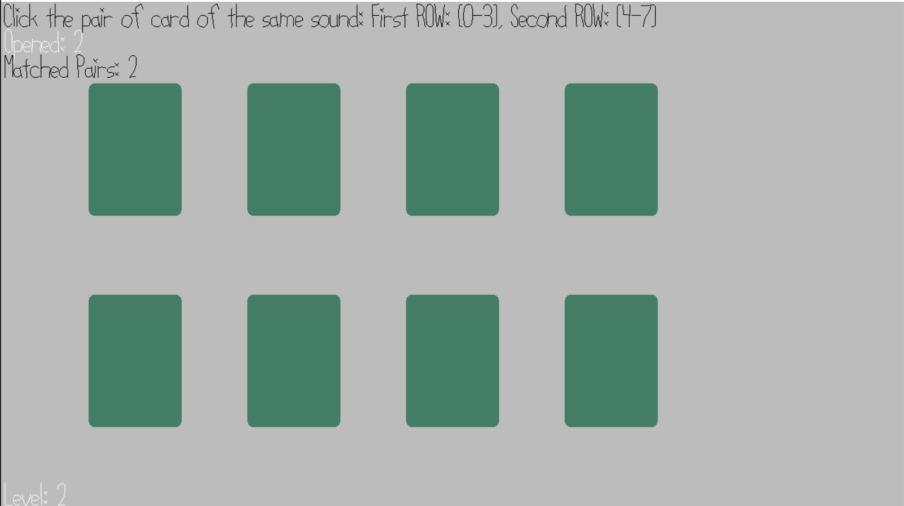

# Sound Pair Match
Author: Shao-Ju Wang

Design: Pair matching but using sound, distraction included.

Screen Shot:

How To Play:

Use [0-9], [a-c], depending on the level, to open cards, match the card with the same sound.

TODO: 1. Apply textures to card. 2. Open the card by mouse click

This game was built with [NEST](NEST.md).
